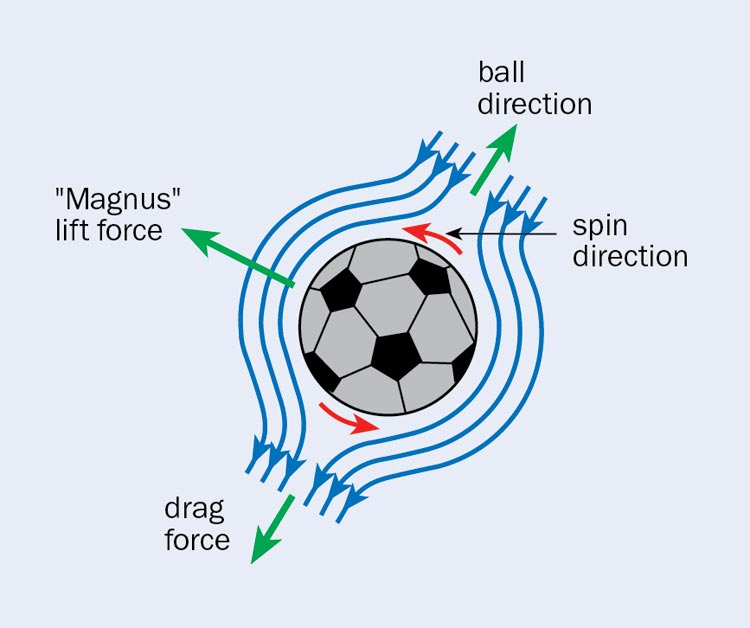

```{r setup, include=FALSE}
knitr::opts_chunk$set(echo = TRUE)
```

```{r, include=TRUE, echo=FALSE}
# Loading the packages with the pacman library
if (!require("pacman")) install.packages("pacman")
pacman::p_load(deSolve, pracma, plotly)
```

# Introduction

Introduction of the research and introduction research questions

Ever heard of the game FIFA by EA? It is the most popular football game in the 
world played by millions. So to get the correct trajectory for the ball is one of 
the most important aspects of the game. If the trajectory is not realistic it 
wouldn't be as good of a game as it is now. One of the ways to get the correct 
trajectory is calculating it using a model with different forces acting on the ball. 
Think of things like speed, gravity and air resistance. By accurately modelling 
these forces, we can predict the path of a football. This is essential for things 
like video games but also for predicting paths of different things or projectiles.

So in this report the aim is to provide a model that models the trajectory of a
football. This will be done using different physics formulas modelling the forces 
at play like speed, gravity and air resistance. Furthermore the specific parameters
that must be chosen to accurately model these forces will be examined and explained. 

With all this in mind the question is, how can the trajectory of a football be 
accurately modelled using the different forces at play?

## Goal

-   Describe Goal (not the educational goal but the research goal)
-   Describe how you reach the goal (e.g. make model and figures, use
    different setting)
-   formulate hypothesis

As you might have guessed the goal is to model the trajectory of a football that 
is kicked by someone. This is done by calculating the different forces at play on 
any given moment. The forces chosen to model are velocity, acceleration and the 
Magnus force. With these three the ball's position can be calculated for any given 
moment. The formulas for these three will be explained further in the theory section. 
In the results different starting parameters will be used to showcase multiple 
paths of a football using tools like Plotly to visualize the trajectories. The 
expectation is that this model will show a realistic trajectory of a football 
considering the effects of the different forces.

## Theory

-   Describe the model
-   Picture of the model

To understand this model a little knowledge about basic physics can be
useful, here is a small explanation about the forces. So everywhere
around you there are different forces at play. One of the important
forces is the air resistance experienced with most outside activities
like running, cycling and even walking. For example with running you
have to use energy to move forward, this is translated to force by your
muscles. While moving you push the air out of the way and to do so the
force you generate must be higher than the air resistance. If it is
windy outside it takes more energy to move the same distance because the
air exerts a higher force on you. So lets take a look at al the forces
on a football. Air resistance is one of them of course, but also gravity
and the Magnus force. All the forces on the ball are combined in
different formulas. Velocity, Acceleration and a formula for the Magnus
force. These three are split in a X-, Y-, Z-axis to calculate the forces
in a 3D plane.

```{r ball picture, echo=FALSE, out.width='95%'}

```

### Magnus Force Implimentation

There are multiple forces that are interaction with the ball when u kick
it. Things like gravity, acceleration and air resistance. But since the
ball has a spin the magnus force comes in to play as well. This force
deflects the ball in flight \cite{Che21}. The formula for the magnitude
of the acceleration created by magnus force is the following.

$$ \overrightarrow{f} = \frac{8}{3} \pi \rho r^3\cdot\overrightarrow{\omega} \cdot \overrightarrow{V}$$

The constant:

$$ \lambda = \frac{8}{3} \pi \rho r^3 $$

Equals:

$$ \overrightarrow{f} = \lambda \cdot  \begin{vmatrix} \overrightarrow{i} & 
\overrightarrow{j} & \overrightarrow{k}\\ \omega_{x} & \omega_{y} & \omega_{z} \\ V_{x} & 
V_{y} & V_{z} \end{vmatrix} $$

The $\omega$ is the spin on the ball when kicked aka the angular
velocity. The $r$ stands for radius and $\rho$ is the density of the
ball. $V$ stands for the velocity relative to the surrounding air. In
the model we will implement the velocity for the general displacement of
the ball in like the formula below.

$$ \frac{\delta V}{\delta t} = \sqrt{velocity_{x}^2 + velocity_{y}^2 + velocity_{z}^2} $$
Now we solve the magnus displacement for each axis, first for
x:$$ \frac{\delta\lambda_{x}}{\delta t} = \lambda \cdot (\omega_{y} \cdot V_{z}- \omega_{z} \cdot V_{y}) \cdot e^-\mu $$

Now for
y:$$ \frac{\delta \lambda_{y}}{\delta t} = \lambda \cdot (\omega_{y} \cdot V_{z}- \omega_{z} \cdot V_{x}) \cdot e^-\mu $$

And for
z:$$ \frac{\delta\lambda_{z}}{\delta t} = \lambda \cdot (\omega_{y} \cdot V_{x}- \omega_{x} \cdot V_{y}) \cdot e^-\mu $$

### Acceleration

The speed of the ball slows down over time due to all acting forces on
it. These forces are magnus force, air resistance and gravity. Now to
add them all together. First for the vertical axis:

$$ \frac{\delta a_{z}}{\delta t} = \frac{-k \cdot V_{z} \cdot V + \lambda_{z} - m \cdot g}{m} $$

Here, $k$ represents the air resistance, $v_z$ the upward speed, $V$ is
the total speed on the ball, $m$ is the total mass , $g$ is the force of
gravity and $\lambda_z$ is the magnus.

Second the horizantal axis:

$$ \frac{\delta a_{x}}{\delta t} = \frac{-k \cdot V_{x} \cdot V + \lambda_{x} }{m} $$

Here, $V_x$ is the horizontal speed and $\lambda_x$ is the horizontal
magnus force.

Third is the sideways
direction:$$ \frac{\delta a_{y}}{\delta t} = \frac{-k \cdot V_{y} \cdot V + \lambda_{y}}{m} $$

Here, $V_y$ is the sideways speed and $\lambda_y$ is the magnus force in
the sideways direction.

# Methods

## The software model

-   Describe the software tools used, as well as the libraries.

To achieve the goal of accurately modelling the path of a football, a combination
of mathematical formulas, computational and visualization tools are utilized.
The main piece of software that ties all of this together is R (version 4.4.1).
R is a powerful tool for statistical computing and visualizing this in all sorts 
of graphs. Additionally a few extra R libraries are imported and used: 
\begin{itemize}
  \item deSolve (version 1.40) The deSolve package provides a set of functions for 
        solving ordinary differential equations (ODEs) and partial differential
        equations (PDEs) in R. It is commonly used in fields such as biology,
        chemistry, physics, and engineering to model and simulate dynamic systems.
  \item Pracma (version 2.4.4) This package provides R implementations of more advanced 
        functions in numerical analysis, with a special view on on optimization and 
        time series routines. Uses Matlab/Octave function names where appropriate 
        to simplify porting. Some of these implementations are the result of courses 
        on Scientific Computing (“Wissenschaftliches Rechnen”) and are mostly intended 
        to demonstrate how to implement certain algorithms in R/S. Others are 
        implementations of algorithms found in textbooks.
  \item Plotly (version 4.10.4) Plotly's R graphing library makes interactive, 
        publication-quality graphs. Examples of how to make line plots, scatter plots, 
        area charts, bar charts, error bars, box plots, histograms, heatmaps, subplots, 
        multiple-axes, and 3D (WebGL based) charts.
\end{itemize}

-   Describe the software implementation.

The deSolve library is used the solve the multiple differential equations in the model.
These are mainly used to calculate the acceleration, velocity and position based 
on the different forces acting on the football. With a function in the deSolve library
the model is run over a defined time and stored in a data frame. To visualize all
the positions of the ball the library Plotly is used. This is a library to make 
interactive plots in R.

## Model configuration

-   Explain chosen initial state, parameter values and time sequence. Use
tables with values as for example below.

The model uses a lot of different parameters and constants as seen in the multiple
formulas and the table below. Every parameter has a initial value and the constants 
have a constant value. In the table below every one of those is shown with a small
description and the initial or constant value. The parameters used to simulate 
a still football being kicked are v, angle.z, angle.y, angle.x and state_straight. 
These parameters are used as a start point in the model, otherwise the ball will not move.

Most of these parameters are self-explanatory and chosen based on typical physical
characteristics of a football. And the others are mostly some constants and coefficients
that are needed for the formulas. These are fixed and always the same, so these can
be found online when searching for the formulas. All the parameters as well as the
starting values are entered in the piece of R code shown under the table. These can 
later be used in the code that functions as the model, which will be discussed in
the results.

| Variable/Parameter | Description                                         | Value/Formula                                           |
|------------------|---------------------------|---------------------------|
| r                  | Radius of the football                              | 0.11 m                                                  |
| rho                | Air density                                         | 1.29 $kg/m^3$                                                  |
| cw                 | Drag coefficient of the football                    | 0.5                                                     |
| cm                 | Magnus coefficient                                 | 1                                                       |
| m                  | Mass of the football                                | 0.445 kg                                                 |
| k                  | Drag force coefficient                              | $\frac{1}{2} \cdot cw \cdot \rho \cdot (\pi \cdot r^2)$ |
| mu                 | Friction coefficient                                | 0.1                                                     |
| g                  | Gravitational acceleration                          | 9.81 $m/s^2$                                                    |
| km                 | Another coefficient                                 | $cm \cdot 8 \cdot \rho \cdot r^3$                       |
| f                  | Force                                               | 10 N                                                   |
| lambda             | Magnus constant                                     | $\frac{8}{3} \pi \cdot r^3$                             |
| e                  | Euler's number                                      | $e \approx 2.71828$                                     |
| v                  | Initial velocity of the football                    | 30                                                      |
| angle.z            | Initial angle of the football's trajectory (z-axis) | 25 degrees                                              |
| angle.y            | Initial angle of the football's trajectory (y-axis) | 30 degrees                                              |
| angle.x            | Initial angle of the football's trajectory (x-axis) | 7 degrees                                               |
| state_straight     | Initial state of the football                       | See code                                                |
| times              | Time steps                                          | 0 to 10 with step size 0.01                             |

```{r parameters, echo=FALSE}
# variables & parameters
r <- 0.11
rho <- 1.29
cw <- 0.5
cm <- 1
parameters <- c(m = 0.445, k = (1/2) * cw * rho * (pi * r^2),
                mu = 0.1, g = 9.81, km = cm * 8 * rho * r^3, f = 10,
                lambda =  8/3*pi*r^3, e = exp(1))

# state of start
state_straight <- c(velocity = c(x = -0.5,
                                 y = 50,
                                 z = 10),
                    position = c(x = 0, y = 0, z = 0),
                    angular = c(x = 2,
                                y = -2,
                                z = 4))

# time steps in seconds 
times <- seq(0, 10, by = 0.01)
```

# Results

-   Introduction of results, how does it answer your research questions.

In this section, the results of the simulation are shown. The model shows the 
trajectory of a football based on a calculation taking different forces, like 
drag, Magnus and gravitational forces into account. 

In the piece of code below the formulas of these different forces are used to form
the model. These are put in a R function simply named model. This function is used
with the deSolve library to solve the differential equations and calculate the 
acceleration, velocity and angular velocity of the football on every time step. With
these parameters every possible position can be calculated.

```{r model, echo=FALSE, include=TRUE}
# Formulas in a function named model
model <- function(t, y, parms){
  with(as.list(c(y, parms)), {
    # velocity & positioning
    velocity <- c(velocity.x, velocity.y, velocity.z)
    position <- c(position.x, position.y, position.z)
    angular <- c(angular.x, angular.y, angular.z)
    
    # Model for acceleration
    V <- sqrt(velocity.x^2 + velocity.y^2 + velocity.z^2) 
    
    # Magnus force components
    lambda.z <- lambda * (angular.y*velocity.x- angular.x * velocity.y) * e^-mu
    lambda.x <- lambda * (angular.y*velocity.z- angular.z * velocity.y) * e^-mu
    lambda.y <- lambda * (angular.x*velocity.z- angular.z * velocity.x) * e^-mu

    # Accelerations
    az <- (-k * velocity.z * V + lambda * (angular.y*velocity.x- angular.x * velocity.y) * e^-mu - m * g) / m
    ax <- (-k * velocity.x * V + lambda * (angular.y*velocity.z- angular.z * velocity.y) * e^-mu) / m
    ay <- (-k * velocity.y * V  + lambda * (angular.x*velocity.z- angular.z * velocity.x) * e^-mu) / m
    
    acc <- c(ax, ay, az)
    
    # Return the derivatives
    return(list(c(acc, velocity, angular)))
  }
  )
}
```

```{r results, include=T}
# performing simulation
out <- as.data.frame(ode(times = times,
                         y = state_straight,
                         parms = parameters,
                         func = model))

# filtering results
output <- subset(out, position.z >= 0)
```

```{r figures, fig.cap= "The trajectory of a football in the x, y and z space"}
# set up a 2x2 grid
par(mfrow = c(2, 2))

# 2 dimensional fig of trajectory from side
plot(output$position.y,
     output$position.z,
     type = "l",
     ylab = "< Down | Up >",
     xlab = "< Player | Goal >",
     main = "Trajectory from the side")

segments(x0 = 30, y0 = min(output$position.z), x1 = 30, y1 = 2.44, col = "red")

# 2 dimensional fig of trajectory
plot(output$position.x,
     output$position.z,
     xlim = c(-6, 6),
     type = "l",
     ylab = "< Down | Up >",
     xlab = "< Left | Right >",
     main = "Trajectory from the front")
# first line from (-3.66, 0) to (-3.66, 2.44)
segments(x0 = -3.66, y0 = 0, x1 = -3.66, y1 = 2.44, col = "red")

# second line from (-3.66, 2.44) to (3.66, 2.44)
segments(x0 = -3.66, y0 = 2.44, x1 = 3.66, y1 = 2.44, col = "red")

# third line from (3.66, 2.44) to (3.66, 0)
segments(x0 = 3.66, y0 = 2.44, x1 = 3.66, y1 = 0, col = "red")


# 2 dimensional fig of trajectory
plot(x = output$position.x,
     y = output$position.y,
     xlim = c(-6, 6),
     type = "l",
     ylab = "< Player | Goal >",
     xlab = "< Left | Right >",
     main = "Trajectory from above")
 # first line from (-3.66, 30) to (3.66, 30)
segments(x0 = -3.66, y0 = 30, x1 = 3.66, y1 = 30, col = "red")


```
In this figure, three perspectives of the trajectory are shown: the side, front, and above perspectives. A goal is lined out in red, standing 30 meters from the shot. In the front and above perspectives, it is visible that the arc is skewed to the right side before traveling to the left. This is the Magnus effect.


-   Describe what can be seen in such way that it leads to an answer to
    your research questions
-   Give your figures a number and a descriptive title.
-   Provide correct axis labels (unit and quantity), legend and caption.
-   Always refer to and discuss your figures and tables in the text -
    they never stand alone.

# Discussion and Conclusion

## Discussion

-   Compare your results with what is expecting from the literature and
    discuss differences with them.
-   Discuss striking and surprising results.
-   Discuss weaknesses in your research and how they could be addressed.

## General conclusion and perspective

Discuss what your goal was, what the end result is and how you could
continue working from here.

```{=tex}
\begin{thebibliography}{9}

\bibitem{Soertaert10}
Soetaert, K., Petzoldt, T., and Woodrow Setzer, R.: \textit{Solving  in R: package deSolve}, J. Stat. Softw., 33, 1-25, 2010.


\bibitem{Che21}
Che,Y., Abo Keir,M.(2022).Study on the training model of football movement trajectory drop point based on fractional differential equation. Applied Mathematics and Nonlinear Sciences,7(1) 425-430. https://doi.org/10.2478/amns.2021.2.00095


\end{thebibliography}
```

# Attachments

```{r attachment 1}
# variables & parameters
r <- 0.11
rho <- 1.29
cw <- 0.5
cm <- 1
parameters <- c(m = 0.445, k = (1/2) * cw * rho * (pi * r^2),
                mu = 0.1, g = 9.81, km = cm * 8 * rho * r^3, f = 10,
                lambda =  8/3*pi*r^3, e = exp(1))

# state of start
v <- 30
angle.z <- 25
angle.y <- 30
angle.x <- 7
state_straight <- c(velocity = c(x =6,
                                 y = 37.5,
                                 z = 11.5),
                    position = c(x = 0, y = 0, z = 0),
                    angular = c(x = 2,
                                y = -2,
                                z = 14))

# time steps
times <- seq(0, 10, by = 0.01)

# model
model <- function(t, y, parms){
  with(as.list(c(y, parms)), {
    # velocity & positioning
    velocity <- c(velocity.x, velocity.y, velocity.z)
    position <- c(position.x, position.y, position.z)
    angular <- c(angular.x, angular.y, angular.z)
    
    # Model for acceleration
    V <- sqrt(velocity.x^2 + velocity.y^2 + velocity.z^2) 
    
    # Magnus force
    lambda.z <- lambda * (angular.y*velocity.x- angular.x * velocity.y) * e^-mu
    lambda.x <- lambda * (angular.y*velocity.z- angular.z * velocity.y) * e^-mu
    lambda.y <- lambda * (angular.x*velocity.z- angular.z * velocity.x) * e^-mu


    az <- (-k * velocity.z * V + lambda * (angular.y*velocity.x- angular.x * velocity.y) * e^-mu - m * g) / m
    ax <- (-k * velocity.x * V + lambda * (angular.y*velocity.z- angular.z * velocity.y) * e^-mu) / m
    ay <- (-k * velocity.y * V  + lambda * (angular.x*velocity.z- angular.z * velocity.x) * e^-mu) / m

    acc <- c(ax, ay, az)
    return(list(c(acc, velocity, angular)))
  }
  )
}
```