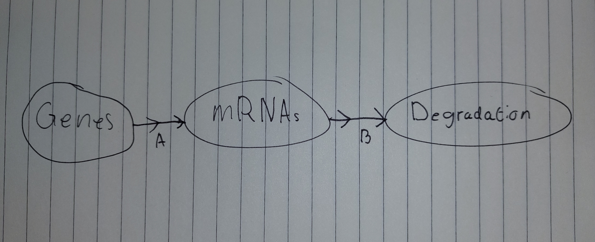

```{r setup, include=FALSE}
knitr::opts_chunk$set(echo = TRUE)
```
## Week 1 Opdracht

### 1.0 Opdracht

[1] Welke parameters moet je programmeren?

- R: Het nummer van transcripties
- r: De afname van de snelheid van de transcripties
- m: het nummer van nieuwe transcripties die worden geproduceerd per sec
    
[2] Zoek bronnen op internet die uitleggen waar de formule vandaan komt. $$ \frac{dR}{dt} = -r*R + m $$ 
    
<https://arep.med.harvard.edu/pdf/Chen99.pdf>
    
[3] Teken het biologisch model en leg de vertaling naar de formule uit.



Het DNA word doormiddel van transcriptie omgezet naar mRNA, waarna het weer word afgebroken met een bepaalde     snelheid. 'A' in de tekening geeft dus 'm' aan in de formule, en de 'B' geeft de 'r' aan in de formule.
    
[4] Wat is de return waarde van de model functie in R? Waarom return je die en niet R zelf?

Een List. Omdat je met een List van de waarden meer dingen kan doen. Dingen zoals meerdere libraries gebruiken om nog aan de data te sleutelen. 

\newpage

# 2.0 Opdracht
```{r}
library(deSolve)

steady_parms <- c(m= 10, r = 0.1)
incr_parms <- c(m= 12, r = 0.1)
decr_parms <- c(m = 8, r = 0.1)

volume <- function(t, R, parms){
  with(as.list(c(parms)), {
    dR <- - r * R + m
    return(list(c(dR)))
    }
    )
}

state <- c(Volume = 100)
times <- seq(0, 100, by = 1)

steady <- ode(times = times, y = state, parms = steady_parms, func = volume)
increasing <- ode(times = times, y = state, parms = incr_parms, func = volume)
decreasing <- ode(times = times, y = state, parms = decr_parms, func = volume)


plot(steady, col = "Red")
lines(increasing, col = "Green")
lines(decreasing, col = "Blue")
legend(-5, 145, legend = c("Steady", "Increasing", "Decreasing"),
       col = c("Red", "Green", "Blue"), lty = 1)
```