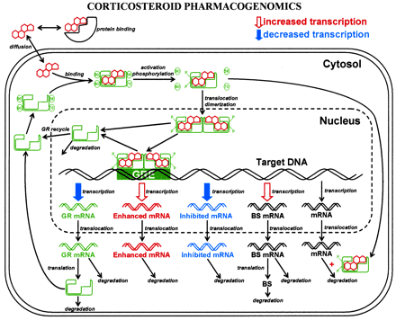

```{r setup, include=FALSE}
knitr::opts_chunk$set(echo = TRUE)
```

# Introductie

In dit onderzoek worden de waardes van het model vergeleken met de waardes van
het fysieke onderzoek bij de ratten. Dit zorgt ervoor dat de werking van het model
word bepaald en of deze goed werkt. Om dit te vergelijken worden met behulp van 
verschillende grafieken de resultaten van het model en het experiment vergeleken.
Nu is dus de vraag of dit te behalen is met de verschillende grafieken en of dit
een goed beeld geeft.

## Doel

Met dit onderzoek word dus vooral gekeken naar de werking van het model ten opzichte
van de resultaten uit de echte wereld. Dit doel word behaald door de verschillende
waardes uit het model en het onderzoek te vergelijken. Door grafieken te maken
worden ze het best vergeleken en is het ook op een overzichtelijke manier te zien.
De verwachting zal zijn dat het model in grote lijnen overeen zal komen met het 
experiment. Bij het experiment is er natuurlijk altijd een mogelijkheid op uitschieters
en meetfouten. Hierdoor kan het zijn dat op sommige punten de waardes niet overeen
komen.

  - Describe Goal (not the educational goal but the research goal)
  - Describe how you reach the goal (e.g. make model and figures, use different setting)
  - formulate hypothesis

## Theorie

In figuur 1 wordt een biologisch model weergegeven van de werking van corticosteroïden. 
De eerste stap is via diffusie de corticosteroïden binnen krijgen in de cel. Deze 
corticosteroïden binden zich dan aan een receptor, waarna dit receptorcomplex de 
nucleus van een cel binnentreedt. Dit bind zich aan het target DNA waardoor de 
transcriptie van sommige onderdelen word verlaagd of verhoogd. Een van die onderdelen 
is een vermindering in de aanmaak van receptoren. Hierdoor word er op een bepaald 
moment een evenwicht bereikt. Dit is te zien in de resultaten die uit het model komen.

```{r, echo=FALSE}
#| fig.cap="Overzicht van een biologisch model over
#|  de expressie van glucocorticoid receptoren"

```
## Functions

$$\frac {dmRNA_{R}}{dt} = k_{s\_Rm} * \biggl(1-\frac {DR(N)}{IC_{50\_Rm} + DR(N)}\biggr) - k_{d\_Rm} * mRNA_{R}$$
$$\frac {dR}{dt} = k_{s\_R} * mRNA_{R} + R_{f} * k_{re} * DR(N) - k_{on} * D * R - k_{d\_R} * R$$
$$\frac {dDR}{dt} = k_{on} * D * R - k_{T} * DR$$
$$\frac {dDR(N)}{dt} = k_{T} * DR - k_{re} * DR(N)$$
```{r}
data_MPL <- read.csv("MPL.csv", na.strings = "NA")
median_MPL_01 <- median(data_MPL$MPL_conc[data_MPL$dose==0.1], na.rm=TRUE)
median_MPL_03 <- median(data_MPL$MPL_conc[data_MPL$dose==0.3], na.rm=TRUE)
```

Voor de concentratie van methylprednisolon (MPL) word de mediaan van alle concentraties 
over de tijdstippen berekend, zoals hierboven in het code blok te zien is. Dit 
gebeurd voor elke doses apart waarbij de volgende waardes uitkomen: `r median_MPL_01` 
ng/ml en `r median_MPL_03` ng/ml. Deze waardes voor respectievelijk de 0.1 en 0.3 
doses worden gebruikt bij het omzetten naar de juiste eenheden voor de concentratie 
MPL in het model.

```{r}
medians <- aggregate(data_MPL[,c("MPL_conc","mRNA","Free_receptor")],
                     list(data_MPL$dose,data_MPL$time),
                     median, na.rm=TRUE)
names(medians)[1:2] <- c("dose","time")
```

Verder wordt de dataset nog wat opgeschoond zodat die wat makkelijker in gebruik
is. Op elk tijdstip in de dataset zijn namelijk vier metingen om de kans op
meetfouten te verkleinen. Ook hier wordt daarom weer de mediaan per doses per 
tijdstip gepakt van de metingen, waarna deze worden samengevoegd in een nieuwe
dataset. De manier waarop dit gebeurt word hierboven beschreven.

# Methods

## The software model

Het model word gesimuleerd met verschillende formules. Dit gebeurd doormiddel van
de r (versie 4.3.0) programmeer taal. De gebruikte IDE is RStudio (versie 2023.03.0)
met de deSolve (versie 1.35) library. Om door het model heen te lopen word er een
functie opgezet waarbij alle wiskundige formules worden ingevoerd. Door de deSolve functie 
ode() aan te roepen kan er door de model functie heen gelopen worden. Aan deze deSolve
functie worden alle parameters, de startwaarde en de looptijd meegegeven. Op deze 
manier worden de verschillende waardes op een bepaald tijdpunt berekend en is er in
dit geval een biologisch proces gemodelleerd.

- Describe the software tools used, as well as the libraries
- Describe the software implementation (note: code below is an example)
```{r}
if (!require("deSolve", quietly = TRUE))
    install.packages("deSolve")
library(deSolve)

volume_D0.1 <- 14.59
molar_mass <- 374.471
nmol0.1 <- volume_D0.1 * 1000 * (1/ molar_mass)
parameters0.1 <- c(ks_Rm = 2.90, IC50_Rm = 26.2, kon = 0.00329, kT = 0.63, kre = 0.57, 
                Rf = 0.49, kd_R = 0.0572, kd_Rm = 0.612, ksr = 3.22, D = nmol0.1)

volume_D0.3 <- 39.925
nmol0.3 <- volume_D0.3 * 1000 * (1/ molar_mass)
parameters0.3 <- c(ks_Rm = 2.90, IC50_Rm = 26.2, kon = 0.00329, kT = 0.63, kre = 0.57, 
                Rf = 0.49, kd_R = 0.0572, kd_Rm = 0.612, ksr = 3.22, D = nmol0.3)

model <- function(t, y, parms){
  with(as.list(c(y, parms)),{
    dmRNA.R_dt <- ks_Rm * (1-(drn/(IC50_Rm + drn))) - kd_Rm * mRNA.R
    
    dR_dt <- ksr * mRNA.R + Rf * kre * drn - kon * D * R - kd_R * R
    
    dDR_dt <- kon * D * R - kT * dr
    
    dDRN_dt <- kT * dr - kre * drn 
    
    return(list(c(dmRNA.R_dt, dR_dt, dDR_dt, dDRN_dt)))
  }
  )
}

state <- c(mRNA.R = 4.74, R = 267, dr = 0, drn = 0)
times <- seq(0, 168, by = 1)

output0.1 <- as.data.frame(ode(y = state, times = times, func = model, 
                               parms = parameters0.1, method = "euler"))
output0.3 <- as.data.frame(ode(y = state, times = times, func = model, 
                               parms = parameters0.3, method = "euler"))
```

## Model configuration

Explain chosen initial state, parameter values and time sequence. Use tables with values as for example below

De verschillende parameters en variabelen zijn op basis van een aantal experimenten 
met methylprednisolon in ratten bepaald. Deze parameters en variabelen zijn hieronder
in tabel 1 en 2 te zien. De variabelen worden als startwaarden meegegeven aan het model.

\begin{longtable}[l]{l|l|l}
\caption{Parameter Waardes} \\ \hline
\label{param_table}
$\textbf{Parameter}$ & $\textbf{Value}$ & $\textbf{Unit}$                       \\ \hline
\endhead
$k_{s\_Rm}$          & 2.90             & fmol/g liver/h                        \\ \hline
$IC_{50\_Rm}$        & 26.2             & fmol/mg protein                       \\ \hline
$k_{on}$             & 0.00329          & L/nmol/h                              \\ \hline
$k_{T}$              & 0.63             & 1 / h                                 \\ \hline
$k_{re}$             & 0.57             & 1 / h                                 \\ \hline
$R_{f}$              & 0.49             &                                       \\ \hline
$k_{d\_R}$           & 0.0572           & 1 / h                                 \\ \hline
$k_{d\_Rm}$          & 0.612            &                                       \\ \hline
$k_{s\_R}$           & 3.22             &                                       \\ \hline
$D0.1$               & `r nmol0.1`      & nmol/L                                \\ \hline
$D0.3$               & `r nmol0.3`      & nmol/L                                \\ \hline
\end{longtable}

\begin{longtable}[l]{l|l|l}
\caption{Variabele Waardes} \\ \hline
\label{param_table}
$\textbf{Variabele}$ & $\textbf{Value}$ & $\textbf{Unit}$                       \\ \hline
\endhead
$R_{m0}$             & 4.74             & fmol / g liver                        \\ \hline
$R_{0}$              & 267              & fmol/mg protein                       \\ \hline
$DR$                 & 0                & fmol/mg protein                       \\ \hline
$DR(N)$              & 0                & fmol/mg protein                       \\ \hline
\end{longtable}


# Results
Introduction of results, how does it answer your research questions.

## Opdracht 1
```{r}
if (!require("ggplot2", quietly = TRUE))
    install.packages("ggplot2")
library(ggplot2)
#code to generate figures with title, subscripts, legenda etc

ggplot(data = output0.1, aes(x=time, y=mRNA.R)) +
  geom_line() +
  geom_line(data = subset(medians, dose %in% c(0.0, 0.1)), aes(x=time, y=mRNA),
            color="red") +
  geom_point(data = subset(data_MPL, dose %in% c(0.0, 0.1)), aes(x=time, y=mRNA))

ggplot(data = output0.3, aes(x=time, y=mRNA.R)) +
  geom_line() +
  geom_line(data = subset(medians, dose %in% c(0.0, 0.3)), aes(x=time, y=mRNA),
            color="red") +
  geom_point(data = subset(data_MPL, dose %in% c(0.0, 0.3)), aes(x=time, y=mRNA))
# ggplot(data = output0.1, aes(x=time, y=R)) +
#   geom_line() +
#   geom_line(data = subset(medians, dose %in% c(0.0, 0.1)), aes(x=time, y=Free_receptor),
#             color="red") +
#   geom_point(data = subset(data_MPL, dose %in% c(0.0, 0.1)), aes(x=time, y=Free_receptor))
# 
# ggplot(data = output0.3, aes(x=time, y=R)) +
#   geom_line() +
#   geom_line(data = subset(medians, dose %in% c(0.0, 0.3)), aes(x=time, y=Free_receptor),
#             color="red") +
#   geom_point(data = subset(data_MPL, dose %in% c(0.0, 0.3)), aes(x=time, y=Free_receptor))
```

Als is te zien in de figuren 1 en 2 geeft de rode lijn de mediaan aan van de 
gemeten resultaten van het fysieke onderzoek. Dit geeft een beter beeld van de
verschillende metingen omdat er op elk tijdstip 4 metingen zijn gedaan. Door
deze dan weer te geven met de mediaan worden uitschieters en bijvoorbeeld meetfouten
er beter uit gehaald. Dit geeft dan weer een beter beeld van de verkregen resultaten.
Als er dan verder gekeken word naar het verschil in dosseringen is er een groot
verschil te zien. Bij een lagere dosering van het medicijn is duidelijk te zien
dat de verlaging in vrije receptors langzamer en minder groot is. Wat ook vrij logisch
is aangezien er minder methylprednisolon aanwezig is om aan de receptors te binden.

Verder lijkt het model goed overeen te komen op de meeste punten met de resultaten
van het onderzoek. Op sommige tijdstippen en bij bijvoorbeeld receptor mRNA lijken
de waardes wat af te wijken van elkaar. Dit kan aan meerdere dingen gelegen hebben.
Zo kunnen er bijvoorbeeld wat meetfouten zijn geweest, maar kunnen het ook dingen
zijn die moeilijk in een model zijn weer te geven. In het echt kan natuurlijk
een deel van het medicijn nooit binden aan de receptor en meteen afgevoerd worden.
Deze dingen zijn natuurlijk moeilijk weer te geven in een model en kan de verschillen
in sommige resultaten verklaren. Maar over het algemeen lijken het model en de 
onderzoeksresultaten goed overeen te komen.

## Opdracht 2
```{r}

```
- Describe what can be seen in such way that it leads to an answer to your research questions
- Give your figures a number and a descriptive title.
- Provide correct axis labels (unit and quantity), legend and caption.
- Always refer to and discuss your figures and tables in the text - they never stand alone.


# Discussion and Conclusion
## Discussion
- Compare your results with what is expecting from the literature and discuss differences with them.
- Discuss striking and surprising results.
- Discuss weaknesses in your research and how they could be addressed.

## General conclusion and perspective
Discuss what your goal was, what the end result is and how you could continue working from here.


\begin{thebibliography}{9}

\bibitem{Soertaert10}
Soetaert, K., Petzoldt, T., and Woodrow Setzer, R.: \textit{Solving differential equations in R: package deSolve}, J. Stat. Softw., 33, 1-25, 2010.

\end{thebibliography}
