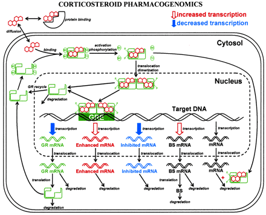

```{r setup, include=FALSE}
knitr::opts_chunk$set(echo = TRUE)
```

# Introductie

Corticosteroïden zijn er in twee vormen: glucocorticoïden en mineralocorticoïden. 
De glucocorticoïden bevorderen de omzetting van eiwitten en vetten naar glucose, dit 
heeft dan ook weer invloed op het bloedsuikergehalte. Daarnaast hebben ze een 
belangrijke functie bij het reguleren van het immuunsysteem, worden ze afgegeven 
bij stress en onderdrukken ze ontstekingsreacties. De mineralocorticicoïden zijn 
vooral belangrijk voor de bloeddruk, water- en zouthuishouding, de terugresorptie 
in de nieren van water en natrium en de excretie van kalium in de nieren. In deze 
opdracht word vooral gefocust op de glucocorticoïden en dan specifiek methylprednisolon, 
vanwege het onderdrukken van ontstekingsreacties.

Wanneer het geneesmiddel wordt toegediend bind deze zich aan de MPL-receptor, waardoor 
een MPL-receptor complex vormt. Dit complex verplaatst zich naar de nucleus. Als 
de concentratie in nucleus een bepaalde waarde bereikt dan wordt de aanmaak van het 
receptor mRNA geremd tot 50% van de beginwaarde.

## Doel

Het doel van dit onderzoek is om een model te implementeren die de expressie van 
glucocorticoid receptoren toont. Hierbij word vooral gekeken naar de remming door 
middel van corticosteroïden. In dit onderzoek wordt naar methylprednisolon (MPL) 
als corticosteroïd, en de werking met het MLP-receptor complex gekeken.

Dit model is opgezet met verschillende differentiaalvergelijkingen die verder worden 
omschreven in [Theorie]. Verder worden de resultaten in grafieken getoond die de 
werking van het model laten zien. Het verwachte resultaat van dit model is dat er 
op een gegeven moment een evenwicht word bereikt in het aantal mRNA receptors.

\newpage

## Theorie

In figuur 1 wordt een biologisch model weergegeven van de werking van corticosteroïden. 
De eerste stap is via diffusie de corticosteroïden binnen krijgen in de cel. Deze 
corticosteroïden binden zich dan aan een receptor, waarna dit receptorcomplex de 
nucleus van een cel binnentreedt. Dit bind zich aan het target DNA waardoor de 
transcriptie van sommige onderdelen word verlaagd of verhoogd. Een van die onderdelen 
is een vermindering in de aanmaak van receptoren. Hierdoor word er op een bepaald 
moment een evenwicht bereikt. Dit is te zien in de resultaten die uit het model komen.

```{r, echo=FALSE}
#| fig.cap="Overzicht van een biologisch model over
#|  de expressie van glucocorticoid receptoren"

```

## Functions

$$\frac {dmRNA_{R}}{dt} = k_{s\_Rm} * \biggl(1-\frac {DR(N)}{IC_{50\_Rm} + DR(N)}\biggr) - k_{d\_Rm} * mRNA_{R}$$

$$\frac {dR}{dt} = k_{s\_R} * mRNA_{R} + R_{f} * k_{re} * DR(N) - k_{on} * D * R - k_{d\_R} * R$$

$$\frac {dDR}{dt} = k_{on} * D * R - k_{T} * DR$$

$$\frac {dDR(N)}{dt} = k_{T} * DR - k_{re} * DR(N)$$

# Methodes

## Het software model

-   Describe the software tools used, as well as the libraries
-   Describe the software implementation (note: code below is an example)

Het model word gesimuleerd met verschillende formules. Dit gebeurd doormiddel van
de r (versie 4.3.0) programmeer taal. De gebruikte IDE is RStudio (versie 2023.03.0)
met de deSolve (versie 1.35) library. Om door het model heen te lopen word er een
functie opgezet waarbij alle wiskundige formules worden ingevoerd. Door de deSolve functie 
ode() aan te roepen kan er door de model functie heen gelopen worden. Aan deze deSolve
functie worden alle parameters, de startwaarde en de looptijd meegegeven. Op deze 
manier worden de verschillende waardes op een bepaald tijdpunt berekend en is er in
dit geval een biologisch proces gemodelleerd.

```{r}
if (!require("deSolve", quietly = TRUE))
    install.packages("deSolve")
library(deSolve)

volume_D <- 20
molar_mass <- 374.471
nmol <- volume_D * 1000 * (1/ molar_mass)
parameters <- c(ks_Rm = 2.90, IC50_Rm = 26.2, kon = 0.00329, kT = 0.63, kre = 0.57, 
                Rf = 0.49, kd_R = 0.0572, kd_Rm = 0.612, ksr = 3.22, D = nmol)

model <- function(t, y, parms){
  with(as.list(c(y, parms)),{
    dmRNA.R_dt <- ks_Rm * (1-(drn/(IC50_Rm + drn))) - kd_Rm * mRNA.R
    
    dR_dt <- ksr * mRNA.R + Rf * kre * drn - kon * D * R - kd_R * R
    
    dDR_dt <- kon * D * R - kT * dr
    
    dDRN_dt <- kT * dr - kre * drn 
    
    return(list(c(dmRNA.R_dt, dR_dt, dDR_dt, dDRN_dt)))
  }
  )
}

state <- c(mRNA.R = 4.74, R = 267, dr = 0, drn = 0)
times <- seq(0, 48, by = 1)

output <- ode(y = state, times = times, func = model, parms = parameters)
```

## Model configuratie

Explain chosen initial state, parameter values and time sequence. Use tables with values as for example below

De verschillende parameters en variabelen zijn op basis van een aantal experimenten 
met methylprednisolon in ratten bepaald. Deze parameters en variabelen zijn hieronder
in tabel 1 en 2 te zien. De variabelen worden als startwaarden meegegeven aan het model.

\begin{longtable}[l]{l|l|l}
\caption{Parameter Waardes} \\ \hline
\label{param_table}
$\textbf{Parameter}$ & $\textbf{Value}$ & $\textbf{Unit}$                       \\ \hline
\endhead
$k_{s\_Rm}$          & 2.90             & fmol/g liver/h                        \\ \hline
$IC_{50\_Rm}$        & 26.2             & fmol/mg protein                       \\ \hline
$k_{on}$             & 0.00329          & L/nmol/h                              \\ \hline
$k_{T}$              & 0.63             & 1 / h                                 \\ \hline
$k_{re}$             & 0.57             & 1 / h                                 \\ \hline
$R_{f}$              & 0.49             &                                       \\ \hline
$k_{d\_R}$           & 0.0572           & 1 / h                                 \\ \hline
$k_{d\_Rm}$          & 0.612            &                                       \\ \hline
$k_{s\_R}$           & 3.22             &                                       \\ \hline
$D$                  & `r nmol`         & nmol/L                                \\ \hline
\end{longtable}

\begin{longtable}[l]{l|l|l}
\caption{Variabele Waardes} \\ \hline
\label{param_table}
$\textbf{Variabele}$ & $\textbf{Value}$ & $\textbf{Unit}$                       \\ \hline
\endhead
$R_{m0}$             & 4.74             & fmol / g liver                        \\ \hline
$R_{0}$              & 267              & fmol/mg protein                       \\ \hline
$DR$                 & 0                & fmol/mg protein                       \\ \hline
$DR(N)$              & 0                & fmol/mg protein                       \\ \hline
\end{longtable}

# Resultaten

Introduction of results, how does it answer your research questions.

Hieronder zijn met vier verschillende grafieken de waardes van verschillende stappen
in het proces te zien. Door naar deze grafieken te kijken is er goed een verband
te leggen tussen de verschillende stappen en waardes. Onder de grafieken wordt
verder omschreven wat in elke grafiek te zien is.

```{r}
plot(output, main = c("Concentratie receptor mRNA",
                      "Concentratie vrije receptor",
                      "Dichtheid receptor complex",
                      "Hoeveelheid\nreceptor complex in celkern"),
     xlab = "Tijd (uren)",
     ylab = "Concentratie (fmol)")
```

In de grafieken is het tijdsverloop te zien van een model over de expressie van 
glucocorticoid receptoren. Het totale tijdsverloop is 48 uur met een stap grootte 
van 1 uur. In dit onderzoek is methylprednisolon (MPL) de gebruikte corticosteroide.
Zoals te zien is gebeuren er na inname van MPL in de eerste paar uur de meeste 
reacties. Hierna word er rond uur 25 een evenwichtstoestand bereikt wat goed te zien 
is aan het afvlakken van de grafieken. Vooral in de eerste grafiek is de werking
van het medicijn te zien. Hierin is namelijk te zien dat de aanmaak van receptor mRNA
op het begin sterk daalt en dat het daarna nog steeds sterk geremd is. Ook in de 
andere grafieken is te zien dat de werking van MPL het gewenste effect heeft. 

-   Describe what can be seen in such way that it leads to an answer to your research questions
-   Give your figures a number and a descriptive title.
-   Provide correct axis labels (unit and quantity), legend and caption.
-   Always refer to and discuss your figures and tables in the text - they never stand alone.

# Discussie en Conclusie 

## Discussie

De verkregen resultaten komen goed overeen met de verwachte resultaten vanuit 
de literatuur. Ook als er gekeken word naar de werking van glucocorticoiden die 
word beschreven in figuur 1 zijn de resultaten goed te verklaren. Verder zijn
er geen verrassende resultaten en zijn er geen zwakheden ontdekt tijdens het
onderzoek.

-   Compare your results with what is expecting from the literature and discuss 
    differences with them.
-   Discuss striking and surprising results.
-   Discuss weaknesses in your research and how they could be addressed.

## Conclusie

Het doel van dit onderzoek was het implementeren van een model die op basis van
formules de werking van corticosteroïden kan beschrijven. Als er dan naar de 
resultaten wordt gekeken en deze worden vergeleken met de verwachte werking van
corticosteroïden volgens de literatuur. Dan kan er worden geconcludeerd dat het 
model de werking goed beschrijft. Voor een vervolg onderzoek kan er gekeken worden
naar de uitwerking van verschillende corticosteroïden, of het uitvoeren van een 
fysiek experiment en deze resultaten te vergelijken met het model.

Discuss what your goal was, what the end result is and how you could continue working from here.

\begin{thebibliography}{9}

\bibitem{Soertaert10}
Elizabeth K. Johnsrud, Sevasti B. Koukouritaki, Karthika Divakaran, Laura L. Brunengraber, Ronald N. Hines and D. Gail McCarver: Human Hepatic CYP2E1 Expression during Development
, 33, 1-25, 2010.

\end{thebibliography}

